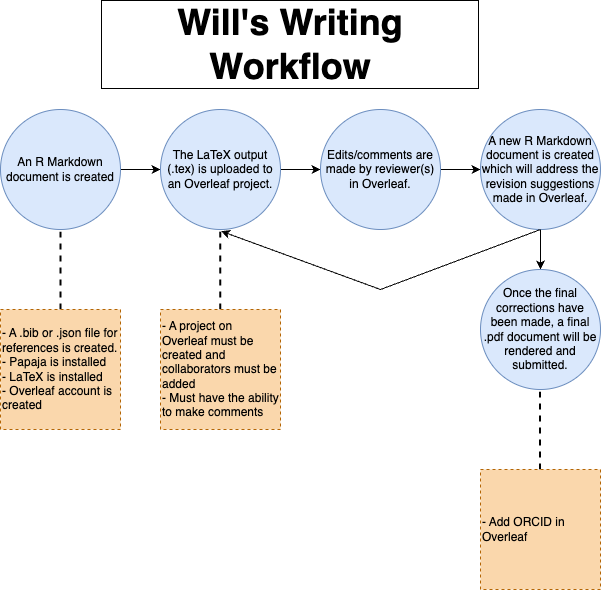

# Will's Writing Workflow

Everyone has a different method for writing papers, each being most conducive to the individual. This can make collaborations with others somewhat cumbersome as adapting to a new workflow may require a learning curve. In an attempt to clearly demonstrate the workflow I use as well as provide some learning material for tools like Overleaf, Zotero and R Markdown, I have put together a detailed workflow that I use to write papers.

## Table of contents

1. [An overview](#1)
2. [What you need](#2)
3. [Writing with R Markdown](#3)
4. [Writing with Overleaf](#4)
5. [Zotero](#5)
6. [Working with others](#6)

## An overview 

    

In my workflow, I use three tools: R Markdown, Overleaf and Zotero. Each of these requires additional dependencies to function properly, so I will detail _everything_ required to make this workflow run smoothly.

Let's begin by installing [R](https://cran.r-project.org/mirrors.html) and [R Studio](https://rstudio-education.github.io/hopr/starting.html) and [Zotero](https://www.zotero.org/download/). Then create an [Overleaf](https://www.overleaf.com/) account. These are the three main programs used in the workflow.

## What you need 

